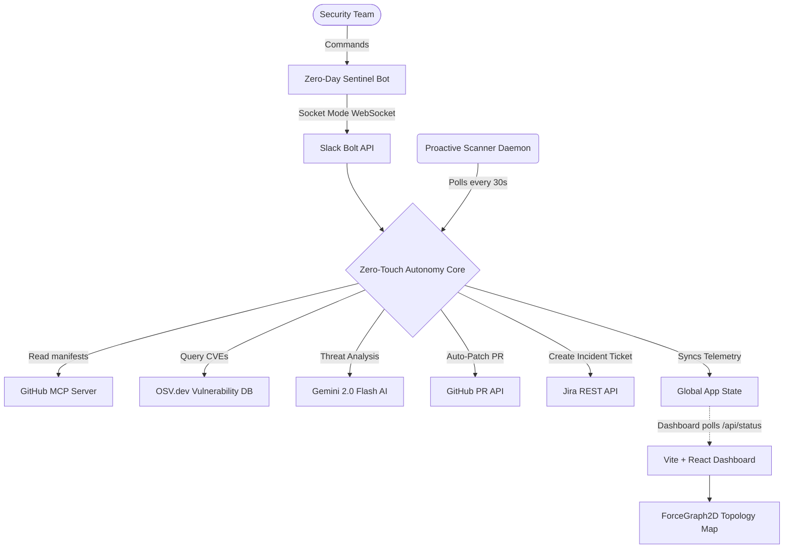

# 🛡️ Zero-Day Sentinel
**Autonomous DevSecOps & AI Auto-Remediation (Slack Hackathon)**

Zero-Day Sentinel is a Level-6 Autonomous Security Agent that lives entirely within your Slack workspace. It continuously scans your repositories across multiple ecosystems (`npm`, `PyPI`, `Go`) in real-time, cross-references dependencies against `OSV.dev`, and uses AI to instantly auto-remediate Zero-Days before a human even has to intervene.

## ✨ Core Features
- **Slack-Native Bot:** Trigger manual scans from Slack with `/scan-dependencies` or pause the daemon with `/toggle-agent`.
- **Zero-Touch Autonomy:** Background daemon detects zero-days, automatically opens a patched Pull Request on GitHub, and creates an Enterprise Jira Ticket (all completely hands-off).
- **Anthropic-Style Topology Dashboard:** A hyper-clean, academic web dashboard powered by a live `ForceGraph2D` physics engine that maps your entire attack surface visually.
- **Universal Ecosystem Parsing:** Connects live via MCP to parse `package.json`, `requirements.txt`, and `go.mod`.

---

## 🏗️ Architecture & Data Flow



---

## 🚀 How to Run Locally

If you are running the project locally (e.g. for a hackathon demo or development), the bot uses **Slack Socket Mode** to connect to Slack without needing a public IP or Ngrok tunnel.

### 1. Start the Sentinel Backend
Open your terminal and run the following:
```bash
# Clone the repository
git clone https://github.com/bkd-dotcom/slack-zero-day-demo.git
cd slack-zero-day-demo

# Create and activate a Python virtual environment
python3 -m venv .venv
source .venv/bin/activate

# Install dependencies
pip install -r requirements.txt

# Start the Flask API and Slack Socket Bot
python3 app.py
```
*Note: Make sure your `.env` file is populated with your Slack and GitHub tokens.*

### 2. Start the Enterprise Dashboard
In a second terminal window, start the React dashboard:
```bash
cd dashboard
npm install
npm run dev
```
Open `http://localhost:5173` in your browser.

---

## ☁️ How to Deploy to Production

If you want to deploy Zero-Day Sentinel to a true enterprise production environment without running it locally, you have two architectural paths:

### Option 1: Virtual Machine (Always-On)
Because the bot currently uses **Socket Mode** (an active WebSocket connection), the easiest cloud deployment is an Always-On VM.
1. Provision a VM on Google Compute Engine or AWS EC2.
2. Clone the repo and install the dependencies.
3. Use a process manager like `systemd` or `pm2` to run `python3 app.py` as a background daemon service 24/7.

### Option 2: Serverless HTTP Webhooks (Cloud Run / Lambda)
If you want to deploy to a serverless container like Google Cloud Run or Vercel, you cannot use Socket Mode (because serverless environments pause background threads between HTTP requests).
1. Disable `SocketModeHandler` in `app.py`.
2. Wrap the Slack Bolt app in the native `SlackRequestHandler` provided by the Bolt framework for Flask.
3. Expose a single HTTP POST route (e.g., `/slack/events`).
4. Deploy the Dockerized Flask app to Cloud Run.
5. In your Slack App Dashboard, disable Socket Mode and paste your public Cloud Run URL into the **Event Subscriptions** and **Interactivity** settings. Slack will now send HTTP POST requests directly to your serverless container!
